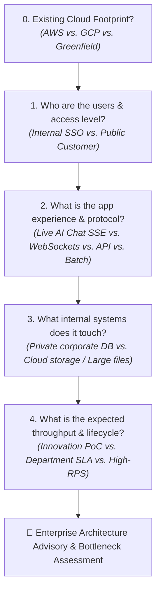

# Serverless Architect Skill (Enterprise Advisory Edition)

This skill provides vendor-agnostic, enterprise-grade **architectural advisory** for evaluating, designing, and selecting serverless hosting platforms on **Amazon Web Services (AWS)** and **Google Cloud Platform (GCP)**. It bridges rapid vibe-coding and innovation prototypes with enterprise-grade security, zero-trust networking, corporate SSO, compliance standards, protocol selection, and **scalability limit assessments**.

---

## 1. Enterprise Guardrails & Non-Negotiables

Every architectural recommendation generated by this skill must enforce core enterprise platform standards:

1. **Zero-Trust Network Security**:
   - **Internal Applications**: Must **never** be exposed directly to the public internet. Enforce an Identity-Aware Proxy via **GCP Cloud Load Balancing + Serverless NEG + IAP** or **AWS Internal Application Load Balancer (ALB) + OIDC / AWS Verified Access**.
   - **Private Database Connectivity**: Serverless runtimes accessing internal enterprise databases (PostgreSQL, MySQL, Oracle, SQL Server) must use **Direct VPC Egress / Serverless VPC Access** (GCP Cloud Run) or **Private Subnet ENI Attachments** (AWS Lambda / ECS Fargate).
   - **NAT Cost & Port Optimization**: Direct cloud service traffic (S3, DynamoDB, GCS, Cloud SQL) must route through **VPC Gateway Endpoints** (free for S3 & DynamoDB) or **Private Service Connect (PSC) / Interface Endpoints (PrivateLink)** to bypass NAT Gateways and avoid $0.045/GB data processing fees and SNAT port exhaustion.

2. **Identity & Secrets Governance**:
   - **No Static Credentials**: Enforce Workload Identity Federation (GCP) or IAM Roles / OIDC (AWS) for CI/CD pipelines (GitHub Actions, GitLab CI) and service execution roles.
   - **Secrets Management**: Secrets must be stored in **GCP Secret Manager** or **AWS Secrets Manager / SSM Parameter Store** and injected as runtime environment variables, never hardcoded in Dockerfiles, repository code, or plain environment variables.

3. **Observability & Audit Compliance**:
   - Structured JSON logging with trace context correlation (Cloud Logging / CloudWatch).
   - Compliance with enterprise audit logging (Cloud Audit Logs / AWS CloudTrail) and encryption at rest using Customer-Managed Encryption Keys (CMEK / KMS) where required.

4. **Environment Tiering, Concurrency & Cold Start SLOs**:
   - **Sandbox / PoC**: Scale-to-zero enabled to eliminate idle waste.
   - **Department Production**: `min-instances >= 1` (GCP Cloud Run) or Provisioned Concurrency (AWS Lambda) to eliminate cold starts and guarantee p99 response SLOs.
   - **Startup Acceleration**: Leverage **GCP Startup CPU Boost** (`startup-cpu-boost`) for heavy container runtimes (Python/Node/FastAPI) to slash initialization latency.

---

## 2. Non-Technical Diagnostic Interview Protocol

When interacting with non-technical or semi-technical stakeholders (e.g., enterprise product managers, innovation leads, vibe coders), ask **plain-English, outcome-driven questions** that capture user experience, performance, and enterprise constraints.

### Interview Rules
1. **Plain Language First**: Avoid cloud jargon (e.g., use *"internal employee single sign-on"* instead of *"OIDC/IdP SAML federation"*).
2. **One Dimension at a Time**: Ask at most 1–2 related questions per turn.
3. **Codebase Inspection**: Check existing repository files (`package.json`, `requirements.txt`, `Dockerfile`, `.env.example`) silently first and confirm observed runtime assumptions.

---

### The 5 Diagnostic Dimensions

#### Question 0: Existing Cloud Footprint
> *"Is your team or organization already anchored in AWS or Google Cloud, or are you looking for an objective comparison between both?"*
* **Option A**: **Google Cloud (GCP) Preferred** — Tailor primary architecture to GCP Cloud Run and GCP services.
* **Option B**: **Amazon Web Services (AWS) Preferred** — Tailor primary architecture to AWS Lambda / ECS Fargate.
* **Option C**: **Greenfield / Multi-Cloud Evaluation** — Provide full comparative trade-offs between both providers.

#### Question 1: User Audience & Security Boundary
> *"Who will use this application, and how should they log in?"*
* **Option A**: **Internal Employees Only** — Needs company Single Sign-On (Google Workspace, Okta, Microsoft Entra ID) and must be blocked from the general public.
* **Option B**: **External Customers / Public Web** — Publicly accessible on a corporate custom domain with web firewall and DDoS protection.
* **Option C**: **System-to-System Only** — Private background worker or API called only by other internal company services.
*(Enterprise Translation: Option A → Cloud Run behind ALB+Serverless NEG+IAP / Lambda or ECS behind internal ALB+OIDC; Option B → Cloud Run with Cloud Armor / ALB with AWS WAF; Option C → Private internal service with IAM auth)*

#### Question 2: App Experience & Protocol Requirements
> *"What does the app do, and how does it exchange data with users?"*
* **Option A**: **Live AI Chat / Streaming (Server-Sent Events - SSE)** — Dynamic web dashboard where AI responses stream in token-by-token (one-way server-to-client streaming).
* **Option B**: **Real-Time Collaboration / WebSockets** — Bi-directional, long-lived interactive communication (e.g. live whiteboards, multi-user documents, chat rooms).
* **Option C**: **Standard Request/Response API** — Fast REST/GraphQL data processing, webhooks, or microservices returning results in under 5 seconds.
* **Option D**: **Heavy Batch Worker / Scheduled Job** — Automated jobs running for 15+ minutes (data sync, document parsing, compliance reporting).
*(Enterprise Translation: Option A → Cloud Run with multi-concurrency / Lambda with Response Streaming; Option B → Cloud Run with native WebSockets / API Gateway WebSocket API + Lambda or ECS Fargate; Option C → Cloud Run / Lambda; Option D → Cloud Run Jobs / ECS Fargate)*

#### Question 3: Internal Corporate Connectivity & Data Sizing
> *"Does this app need to connect to existing internal company databases or handle large file uploads?"*
* **Option A**: **Internal Corporate Database** — Secure private connection to PostgreSQL, MySQL, SQL Server, or Oracle on the internal corporate network.
* **Option B**: **Managed Cloud Database** — Storing data in a dedicated cloud database (Cloud SQL, Cloud Firestore, Aurora Serverless, DynamoDB).
* **Option C**: **Large File / Document Processing (>10 MB)** — Ingesting or generating large PDFs, images, or data dumps.
*(Enterprise Translation: Option A → Direct VPC Egress / RDS Proxy / PgBouncer; Option B → Private IP Cloud SQL / IAM Database Auth; Option C → S3 Pre-Signed URLs / GCS Signed URLs to bypass payload limits)*

#### Question 4: Lifecycle Stage, Throughput & FinOps Expectations
> *"What is the deployment stage, expected request volume, and reliability SLA?"*
* **Option A**: **Innovation PoC / Prototype** — Needs to cost $0 when idle, acceptable to have a 1–2 second warm-up on initial access.
* **Option B**: **Department Production Service** — Steady business hours traffic, zero cold starts, backed by enterprise SLA.
* **Option C**: **High-Throughput Public API (>500 req/sec sustained)** — Constant heavy load requiring cost inflection evaluation.
*(Enterprise Translation: Option A → min-instances = 0; Option B → min-instances >= 1 + health checks + multi-zone HA; Option C → Quota reservations + FinOps comparison vs. GKE Autopilot / EKS Fargate)*

---

## 3. Deep Architectural Realism & Technical Nuances

Refer to [resources/decision_tree.md](resources/decision_tree.md) for full visual decision trees and quota matrices.

### 1. GCP Architecture Deep-Dive

* **Cloud Run + IAP Integration (Mandatory Chain)**:
  * In GCP, IAP cannot be toggled directly on a raw `.run.app` endpoint.
  * Architecture requires: **Application Load Balancer** → **Backend Service with IAP Enabled** → **Serverless Network Endpoint Group (NEG)** → **Cloud Run Service**.
  * Ingress on Cloud Run must be locked to `internal-and-cloud-load-balancing` with IAM permission `roles/run.invoker` granted to the Load Balancer backend service.
* **CPU Allocation Model (Background Thread Trap)**:
  * **CPU allocated during request only (`cpu-throttling=true`)** *(Default)*: CPU drops to near-zero when no HTTP requests are actively processing. Any background asynchronous threads (e.g. async task workers, local cache cleanup, delayed telemetry) **freeze**.
  * **CPU always allocated (`no-cpu-throttling`)**: Required if background tasks run post-response or when maintaining persistent WebSocket connections. Billed continuously per active instance.
* **AI & Accelerated Compute**:
  * Cloud Run supports **Nvidia L4 GPUs** for serverless AI model inference (Ollama, vLLM, Whisper), scaling GPU instances to zero when idle.
* **Multi-Concurrency**:
  * Supports up to **1,000 concurrent requests per instance** (default 80), drastically reducing container count during simultaneous SSE AI streams.

### 2. AWS Architecture Deep-Dive

* **AWS Serverless Container Patterns (ECS Fargate vs. Lambda vs. App Runner)**:
  * **AWS ECS Tasks on Fargate**: The gold-standard enterprise container serverless runtime for AWS. Supports long-running jobs (no 15-minute timeout), persistent stateful connections, complete VPC networking, private ALB ingress with OIDC, and fine-grained IAM task execution roles.
  * **AWS Lambda (with AWS Lambda Web Adapter)**: Best for event-driven, scale-to-zero microservices and APIs. Supports HTTP response streaming via Function URLs.
  * **AWS App Runner Considerations**: Simple PaaS for lightweight web services, but has trade-offs in enterprise environments: **no true scale-to-zero** (memory is billed 24/7 for provisioned instances), slower scale-out (1–3 minutes), and less mature private VPC ingress compared to ALB + ECS Fargate.
* **AWS WebSockets Architecture**:
  * Lambda cannot maintain open persistent TCP connections directly. WebSockets require **Amazon API Gateway WebSocket API** (translating `$connect`, `$default`, `$disconnect` into discrete Lambda executions, pushing updates via `@connections` API) or **ECS Fargate** behind an ALB.

### 3. FinOps & Cost Inflection Modeling

* **Serverless vs. Provisioned Compute Inflection Point**:
  * **Serverless Sweet Spot**: Variable, spiky workloads or services with `< 30%` average continuous CPU utilization.
  * **Inflection Threshold**: At sustained continuous load (`> 200–500 RPS` 24/7), provisioned container clusters (GKE Autopilot, EKS Fargate, or EKS managed node groups with Karpenter) become **30% to 50% cheaper** than pure on-demand serverless runtimes.
* **NAT Gateway Cost Avoidance**:
  * Standard AWS NAT Gateway data processing costs $0.045/GB.
  * Enforce **VPC Gateway Endpoints** for Amazon S3 and DynamoDB (free of charge) and **Interface VPC Endpoints (PrivateLink)** / **GCP Private Service Connect** to prevent multi-gigabyte data transfers from routing through NAT Gateways.

---

## 4. Enterprise Heuristic Matrix (AWS vs. GCP)

| Enterprise App Archetype | **Google Cloud (GCP)** Primary | **Amazon Web Services (AWS)** Primary | Enterprise Security & Protocol Pattern |
| :--- | :--- | :--- | :--- |
| **Internal Full-Stack / AI Chat App** | **GCP Cloud Run** | **AWS ECS Fargate** or **Lambda (Web Adapter)** | • Auth: GCP Load Balancer + Serverless NEG + IAP vs. AWS ALB + OIDC (Okta/Entra ID). • Multi-concurrency handles simultaneous SSE streams. • Zero public access. |
| **Real-Time Bi-Directional Collaboration** | **GCP Cloud Run** (`no-cpu-throttling`) | **AWS API Gateway WebSocket API + Lambda** or **ECS Fargate** | • GCP supports native WebSockets up to 60m. • AWS uses API Gateway connection state management or long-lived Fargate containers. |
| **Microservices & API Gateways** | **GCP Cloud Run** (Internal Ingress) | **AWS Lambda** (Private VPC) | • Private service-to-service IAM authentication. • Secrets injected via Secret Manager / SSM. • Direct VPC Egress / Hyperplane ENI to internal DBs. |
| **Batch Compliance Scraper / AI Job** | **GCP Cloud Run Jobs** | **AWS ECS Tasks on Fargate** | • Execution timeout up to 24 hours. • Egress routed via Cloud NAT / NAT Gateway with static IP. • Terminate immediately on completion ($0 idle). |
| **Static Enterprise Portal** | **GCP Cloud Storage + Cloud CDN** | **AWS S3 + CloudFront** | • Private Origin Access Control (OAC) / Cloud CDN signed backends. • Cloud Armor / AWS WAF protection. • CMEK encryption at rest. |

---

## 5. Enterprise Advisory Deliverable Format

When delivering architecture advisory reports for enterprise stakeholders, structure output into the following sections:

1. **Executive Verdict & Summary**:
   - Primary service recommendation on target cloud provider.
   - Cost tier (scale-to-zero PoC vs. provisioned enterprise SLA) and estimated cost driver summary.
   - Core security perimeter (e.g. Zero-trust SSO boundary).

2. **Security & Identity Architecture**:
   - SSO and identity integration (GCP ALB + Serverless NEG + IAP vs. AWS ALB + OIDC).
   - Private network isolation (Direct VPC Egress / Private Subnets / Security Groups).
   - Secrets management and least-privilege IAM service execution roles.

3. **Compute, Concurrency & Protocol Specifications**:
   - Container/runtime sizing (CPU, RAM, GPU if required).
   - Concurrency model and CPU allocation flags (`cpu-throttling` vs. `no-cpu-throttling`).
   - Cold start mitigations (Startup CPU Boost / `min-instances` / Provisioned Concurrency).
   - Protocol architecture (SSE streaming, native WebSockets, API Gateway WebSocket API).

4. **Scalability Limits & FinOps Guardrails**:
   - Regional concurrency caps, timeouts, and payload limits (with Signed URL upload patterns).
   - Database connection management (Cloud SQL Auth Proxy / AWS RDS Proxy / PgBouncer).
   - NAT cost avoidance (VPC Gateway Endpoints / Private Service Connect).
   - Downstream SaaS rate limit mitigation via asynchronous buffering (Cloud Tasks / Amazon SQS).
   - Cost inflection analysis (when to evaluate GKE Autopilot / EKS).

5. **Multi-Cloud Alignment**:
   - Exact equivalent architecture and service mapping on the alternate cloud provider (AWS or GCP).
