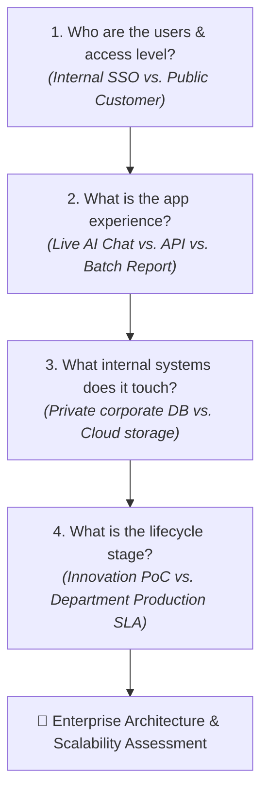

# Serverless Architect Skill (Enterprise Edition)

This skill guides the evaluation, architecture, and selection of serverless hosting platforms on **Amazon Web Services (AWS)** and **Google Cloud Platform (GCP)** within **Enterprise Environments**. It bridges rapid vibe-coding and innovation prototypes with enterprise-grade security, zero-trust networking, corporate SSO, compliance standards, and **future scalability limit assessments**.

---

## 1. Enterprise Guardrails & Non-Negotiables

Every recommendation generated by this skill must enforce core enterprise platform standards:

1. **Zero-Trust Network Security**:
   - Internal applications must **never** be exposed directly to the public internet without an Identity-Aware Proxy (GCP IAP) or AWS Verified Access / ALB OIDC integration.
   - Serverless runtimes accessing internal enterprise databases (PostgreSQL, MySQL, Oracle, SQL Server) must use **Direct VPC Egress / Serverless VPC Access** (GCP Cloud Run) or **VPC Subnet ENI Attachments** (AWS Lambda / App Runner VPC).
2. **Identity & Secrets Governance**:
   - **No static credentials**: Enforce Workload Identity Federation (GCP) or IAM Roles / OIDC (AWS) for CI/CD pipelines (GitHub Actions, GitLab CI) and service accounts.
   - **Secrets Management**: Secrets must be stored in **GCP Secret Manager** or **AWS Secrets Manager / Parameter Store** and injected as runtime environment variables, never hardcoded in Dockerfiles or git repos.
3. **Observability & Audit Compliance**:
   - Structured JSON logging with trace context correlation (Cloud Logging / CloudWatch).
   - Compliance with enterprise audit logging (Cloud Audit Logs / AWS CloudTrail) and encryption at rest using Customer-Managed Encryption Keys (CMEK / KMS) where required.
4. **Environment Tiering & SLAs**:
   - **Sandbox / PoC**: Scale-to-zero enabled to eliminate idle waste.
   - **Department Production**: `min-instances >= 1` (or Provisioned Concurrency) to eliminate cold starts and guarantee p99 response SLOs.

---

## 2. Non-Technical Diagnostic Interview Protocol (Enterprise Focused)

When interacting with non-technical or semi-technical stakeholders (e.g., enterprise product managers, innovation leads, vibe coders), ask **plain-English, outcome-driven questions** that capture both user experience and enterprise constraints.

### Interview Rules
1. **Plain Language First**: Avoid cloud jargon (e.g., use *"internal employee single sign-on"* instead of *"OIDC/IdP SAML federation"*).
2. **One Dimension at a Time**: Ask at most 1–2 related questions per turn.
3. **Codebase Inspection**: Check existing repository files (`package.json`, `requirements.txt`, `Dockerfile`, `env.example`) silently first and confirm assumptions with the user.

---

### The 4 Enterprise Diagnostic Questions

#### Question 1: User Audience & Security Boundary
> *"Who will use this application, and how should they log in?"*
* **Option A**: **Internal Employees Only** — Needs company Single Sign-On (Google Workspace, Okta, Microsoft Entra ID) and must be blocked from the general public.
* **Option B**: **External Customers / Public Web** — Publicly accessible on a corporate custom domain with web firewall and DDoS protection.
* **Option C**: **System-to-System Only** — Private background worker or API called only by other internal company services.
*(Enterprise Translation: Option A → Cloud Run behind IAP / Lambda behind ALB+OIDC; Option B → Cloud Run/App Runner with Cloud Armor/AWS WAF; Option C → Private internal service with IAM auth)*

#### Question 2: App Experience & Interaction Speed
> *"What does the app do, and how does it deliver responses to users?"*
* **Option A**: **Interactive Web App with Live AI Chat** — Dynamic web dashboard where users chat with AI and words stream in live (like ChatGPT typing out an answer).
* **Option B**: **Behind-the-Scenes API** — Fast data processing, webhooks, or microservices returning results in a few seconds.
* **Option C**: **Scheduled / Heavy Background Worker** — Automated jobs running for 15+ minutes (nightly data sync, large PDF/document analysis, compliance reports).
*(Enterprise Translation: Option A → Cloud Run with SSE / Lambda with Web Adapter; Option B → Cloud Run / Lambda; Option C → Cloud Run Jobs / ECS Fargate)*

#### Question 3: Internal Corporate Connectivity & Data
> *"Does this app need to connect to existing internal company databases or sensitive data?"*
* **Option A**: **Yes, internal corporate databases** — Needs secure private connection to internal PostgreSQL, MySQL, SQL Server, or Oracle on the company network.
* **Option B**: **Managed Cloud Database** — Storing data in a dedicated cloud database (e.g., Cloud SQL, Cloud Firestore, Aurora Serverless, DynamoDB).
* **Option C**: **No database / File uploads only** — Storing documents, PDFs, or images in cloud storage buckets.
*(Enterprise Translation: Option A → Direct VPC Egress / Serverless VPC Access; Option B → Private IP Cloud SQL / IAM Database Auth; Option C → GCS / S3 with CMEK)*

#### Question 4: Lifecycle Stage & Reliability Requirement
> *"What is the deployment stage and reliability expectation?"*
* **Option A**: **Innovation PoC / Prototype** — Needs to cost $0 when idle, acceptable to have a 1–2 second warm-up on the first click.
* **Option B**: **Department Production Service** — Always warm, zero delay, backed by enterprise SLA and uptime guarantees.
*(Enterprise Translation: Option A → min-instances = 0; Option B → min-instances >= 1 + health checks + multi-zone HA)*

---

## 3. Known Scalability Limitations & Growth Roadblocks

Every architectural review MUST evaluate and list potential scaling bottlenecks:

### 1. Compute & Concurrency Limits
* **AWS Lambda**:
  * **1,000 Regional Concurrency Limit**: Account-wide pool shared by all functions. A sudden burst on one function can starve and throttle other production workloads.
  * **15-Minute Hard Timeout**: Non-negotiable ceiling. Workflows exceeding 900s must be refactored to Step Functions or ECS Fargate.
  * **Single-Concurrency Cost**: 1 invocation per container instance. 500 concurrent 30s LLM streams = 500 Lambda instances.
  * **Payload Caps**: 6 MB synchronous payload limit (API Gateway / Lambda); 256 KB asynchronous invocation payload limit.
  * **Burst Scaling Rate**: Scales up to 1,000 instances immediately, then 500 instances every 10 seconds.
* **GCP Cloud Run**:
  * **100 Max Instances Default**: Soft quota per region (can be increased via quota ticket to 1,000+).
  * **60-Minute HTTP Ceiling**: Requests cannot exceed 3,600s (Jobs can run up to 24h).
  * **32 MB Request Payload**: Maximum HTTP request payload size.
  * **Compute Ceilings**: Up to 32 GB RAM and 8 vCPUs per instance.
* **AWS App Runner**:
  * **25 Max Instances Default**: Scalability ceiling is constrained unless raised via AWS support.
  * **Slow Cold Scale-out**: Adding new container instances takes 1–3 minutes, causing p99 latency spikes during unexpected surges.

### 2. Networking & Outbound Rate Limiting
* **SNAT Port Exhaustion**: High outbound API volume to enterprise SaaS platforms and external AI APIs through Cloud NAT / AWS NAT Gateway can exhaust the 64,000 ephemeral port limit per IP, causing connection drops.
* **NAT Gateway Bandwidth Costs**: AWS NAT Gateway charges $0.045/GB processed in addition to standard data transfer fees.

### 3. Database Connection Saturation
* **RDBMS Connection Limits**: Direct connections from serverless runtimes to PostgreSQL/MySQL can quickly exhaust `max_connections` (typically 100–500). Mandates connection pooling (Cloud SQL Auth Proxy / AWS RDS Proxy / PgBouncer).
* **Firestore Hotspotting**: Max 1 write per second per document limit. High-frequency global counters or status docs will encounter contention errors.
* **DynamoDB Partition Limits**: 1,000 WCU / 3,000 RCU per physical partition. Poor partition key design leads to hot-partition throttling.

### 4. Downstream Third-Party SaaS Quotas
* **Enterprise SaaS Rate Limits**: Third-party CRM, ticketing, and messaging APIs enforce rolling 24-hour daily quotas and per-minute rate limits. Synchronous ticket processing during traffic bursts will breach quotas unless buffered via asynchronous queues (`Cloud Tasks` / `Amazon SQS`).

---

## 4. Enterprise Heuristic Matrix (AWS vs. GCP)

Refer to [resources/decision_tree.md](resources/decision_tree.md) for full technical limits and flowcharts.

| Enterprise App Archetype | **Google Cloud (GCP)** Primary | **Amazon Web Services (AWS)** Primary | Enterprise Security & Governance Pattern |
| :--- | :--- | :--- | :--- |
| **Internal Full-Stack / AI Web App** | **GCP Cloud Run** | **AWS App Runner** or **Lambda + ALB** | • Auth: GCP Identity-Aware Proxy (IAP) or AWS ALB + Cognito/Okta OIDC. • Zero public access. • Multi-concurrency handles simultaneous SSE AI streams. |
| **Microservices & API Gateways** | **GCP Cloud Run** (Internal Ingress) | **AWS Lambda** (Private VPC) | • Private service-to-service IAM authentication. • Secrets injected via Secret Manager. • Cloud Audit Logs / CloudTrail enabled. |
| **Batch Compliance Scraper / AI Job** | **GCP Cloud Run Jobs** | **AWS ECS Tasks on Fargate** | • Non-root container execution. • VPC Egress via Cloud NAT / AWS NAT Gateway. • Auto-terminates on completion (no orphan compute costs). |
| **Static Enterprise Portal** | **GCP Cloud Storage + Cloud CDN** | **AWS S3 + CloudFront** | • Private Origin Access Control (OAC). • WAF / Cloud Armor rate limiting. • CMEK encryption at rest. |

---

## 5. Enterprise Deliverable Format

When delivering architecture decisions for enterprise stakeholders, always structure output into:
1. **Executive Verdict**: Plain-English recommendation stating primary service, cost tier, and security boundary.
2. **Security & Identity Architecture**: Explains how SSO, private VPC connectivity, and secrets are managed.
3. **Known Scalability Limitations & Growth Roadblocks**: Explicitly list platform limits, soft/hard quotas, downstream SaaS rate limits, and mitigation strategies (e.g. SQS/Cloud Tasks buffering, caching).
4. **Multi-Cloud Alignment**: Clear equivalent architecture on the other provider (AWS or GCP).
5. **Enterprise IaC Starter**: Production-ready OpenTofu/Terraform or `Dockerfile` snippet enforcing non-root user, private VPC egress, and health check probes.
