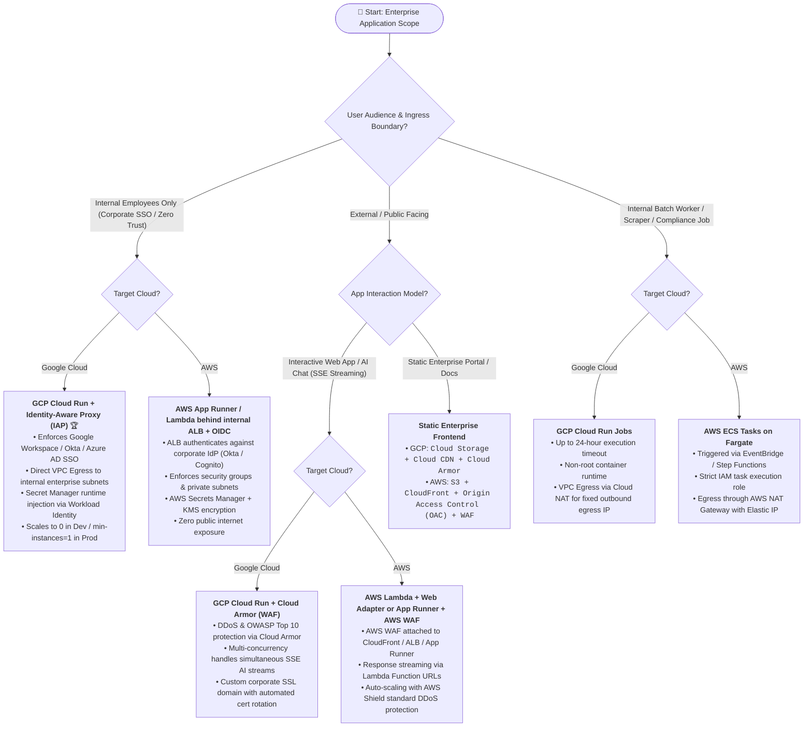
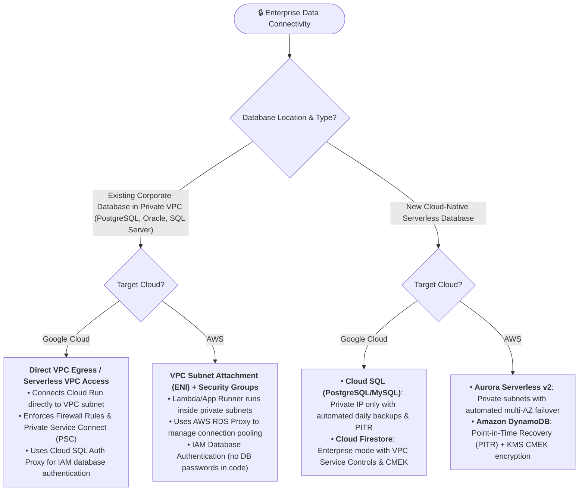

# Enterprise Serverless Architecture: AWS vs. GCP Decision Framework

## 1. Enterprise Master Decision Tree

---

## 2. Enterprise Database & VPC Connectivity Tree

---

## 3. Side-by-Side Enterprise Security & Governance Matrix

| Enterprise Dimension | **Google Cloud Platform (GCP)** | **Amazon Web Services (AWS)** |
| :--- | :--- | :--- |
| **Zero-Trust SSO / IdP** | **Identity-Aware Proxy (IAP)** natively intercepts HTTP before hitting Cloud Run. Works with Google Workspace, Okta, Entra ID. | **Application Load Balancer (ALB) OIDC** or **AWS Verified Access** forwards validated user claims to Lambda/App Runner. |
| **Private VPC Egress** | **Direct VPC Egress** (GA, no connector VM costs) or Serverless VPC Connector into dedicated private subnets. | **VPC Configuration (Hyperplane ENI)** attached to private subnets with Security Groups. |
| **Fixed Outbound Egress IP** | Route VPC traffic through **Cloud NAT** with allocated static external IPs (for whitelisting). | Route VPC traffic through **AWS NAT Gateway** with allocated Elastic IPs. |
| **Secrets Management** | **GCP Secret Manager**: Mounted as environment variables or volume files at runtime via Workload Identity. | **AWS Secrets Manager / SSM Parameter Store**: Resolved via IAM task execution role at runtime. |
| **Data Encryption & CMEK** | **Cloud KMS**: Native Customer-Managed Encryption Keys supported across Cloud Run, GCS, Cloud SQL, and Firestore. | **AWS KMS**: Customer Managed Keys (CMK) enforced across Lambda, S3, Aurora, and DynamoDB. |
| **Audit Logging & Compliance** | **Cloud Audit Logs** (Admin Activity & Data Access) streamed to BigQuery or SIEM (Splunk/Chronicle). | **AWS CloudTrail** + **CloudWatch Logs** streamed to S3 / OpenSearch / SIEM. |
| **CI/CD Deployment Auth** | **Workload Identity Federation** (Keyless OIDC from GitLab CI / GitHub Actions). No static JSON service account keys. | **AWS IAM OpenID Connect (OIDC) Identity Provider** for GitHub/GitLab. No long-lived AWS Access Keys. |
| **Compute Sizing** | Up to **32 GB RAM / 8 vCPUs** per container instance (or GPU instances). | Up to **10,240 MB RAM (10 GB) / 6 vCPUs** per Lambda function; 4 vCPU / 12 GB for App Runner. |
| **Production SLA / Latency** | `min-instances: 1` eliminates cold starts; 99.95% monthly uptime SLA. | Provisioned Concurrency / App Runner minimum 1 instance; 99.95% monthly uptime SLA. |

---

## 4. Hard Limits, Quotas & Scalability Bottlenecks (Verified Accurate)

| Limit / Bottleneck Category | **AWS Lambda / App Runner** | **GCP Cloud Run / Functions** | Scalability Impact & Mitigation |
| :--- | :--- | :--- | :--- |
| **Regional Concurrency Cap** | **1,000 unreserved concurrent executions** per region (account-wide pool). | **100 default max instances** per region (soft limit, easily raised to 1,000+). | *AWS Risk*: One spiking function can exhaust account quota and throttle all other microservices. Set reserved concurrency per function. |
| **Burst Scaling Rate** | Scales up to 1,000 instances immediately, then **500 instances every 10 seconds** until quota is reached. | Rapid scale-out from 0 (sub-second to 2s depending on container image size). | *App Runner Note*: App Runner scales out more slowly (1–3 min per instance), which can cause latency spikes during sudden bursts. |
| **Max Execution Timeout** | **15 minutes (900s)** hard limit for Lambda; 30m for App Runner. | **60 minutes (3,600s)** for Cloud Run HTTP; **24 hours** for Cloud Run Jobs. | *Hard Ceiling*: Multi-step data processing or heavy AI ingestion exceeding 15m must use Cloud Run Jobs or AWS Step Functions / ECS Fargate. |
| **Payload Size Limits** | **6 MB sync** (API Gateway/ALB), **256 KB async** (SQS/EventBridge). | **32 MB HTTP request** body; unconstrained streaming response. | *Impact*: Uploading large files directly to serverless functions will fail. Must use direct S3/GCS Pre-Signed URLs for client uploads. |
| **SNAT Port Exhaustion** | 64,000 concurrent outbound connections per NAT Gateway IP. | 64,000 concurrent outbound connections per Cloud NAT IP. | *Impact*: High concurrency calls to external third-party APIs can exhaust port pool. Use connection reuse / HTTP keep-alive. |
| **RDBMS Connection Exhaustion** | Max connections on RDS instance (100–500). | Max connections on Cloud SQL instance (100–500). | *Impact*: Direct serverless scale bursts saturate database connection pools. Enforce AWS RDS Proxy or Cloud SQL Auth Proxy with pooling (e.g. PgBouncer). |
| **NoSQL Write Contention** | DynamoDB: 1,000 WCU / 3,000 RCU per physical partition. | Firestore: **1 write/sec per document**. | *Impact*: Updating a single global counter or status doc across 200+ users will fail on Firestore. Use distributed counters or sharding. |
| **Downstream SaaS Rate Limits** | External CRM, ticketing, and team messaging API daily/minute limits. | External CRM, ticketing, and team messaging API daily/minute limits. | *Impact*: Unbuffered bursts from 200+ users will trigger 429 Too Many Requests. Mandates asynchronous buffering queues (SQS / Cloud Tasks). |
