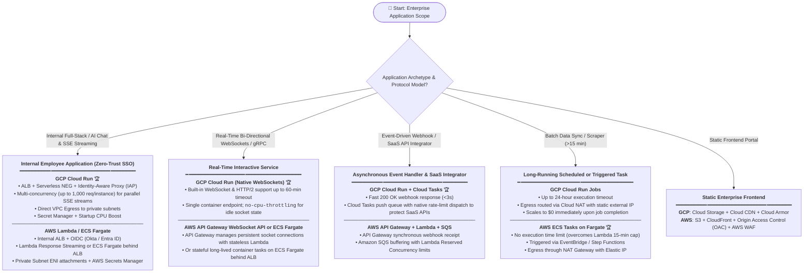
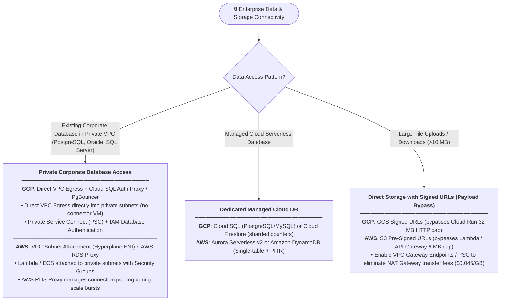

# Enterprise Serverless Architecture: AWS vs. GCP Decision Framework

## 1. Enterprise Master Decision Tree (Capability & Requirements Driven)

---

## 2. Enterprise Database, VPC & Storage Architecture

---

## 3. Side-by-Side Enterprise Security & Governance Matrix

| Enterprise Dimension | **Google Cloud Platform (GCP)** | **Amazon Web Services (AWS)** | Objective Capability Driver |
| :--- | :--- | :--- | :--- |
| **Zero-Trust SSO / IdP** | **ALB + Serverless NEG + Identity-Aware Proxy (IAP)** intercepts HTTP before hitting Cloud Run. Supports Google Workspace, Okta, Entra ID. | **Internal Application Load Balancer (ALB) OIDC** or **AWS Verified Access** authenticates against corporate IdP (Okta / Cognito / Entra ID). | Both offer zero-trust SSO with no public ingress. GCP IAP has tighter serverless integration via Serverless NEGs. |
| **Container Serverless Standard** | **Cloud Run**: Scales from 0 to 1,000+ instances; multi-concurrency (up to 1,000 req/instance); Startup CPU Boost. | **ECS Tasks on Fargate**: True container isolation, custom networking, long-running jobs. (App Runner for simpler PaaS setups). | Cloud Run provides sub-second container scale-out; ECS Fargate provides full VM container isolation and unlimited run times. |
| **Real-Time Protocols** | **Native WebSockets, HTTP/2, gRPC** supported out-of-the-box up to 60 minutes per connection. | **Amazon API Gateway WebSocket API** (stateless Lambda routing) or **ECS Fargate** (stateful socket server). | Cloud Run enables native WebSockets in a single container without API Gateway translation. |
| **CPU Allocation Modes** | • `cpu-throttling=true` (Default, CPU disabled when idle) • `no-cpu-throttling` (CPU always allocated for background threads / sockets). | • Lambda: CPU tied strictly to active invocation. • ECS Fargate: Full continuous vCPU allocation. | Cloud Run toggle allows continuous CPU without paying for dedicated VMs. |
| **Private VPC Connectivity** | **Direct VPC Egress** directly into subnet (no connector VM overhead) with Private Service Connect (PSC). | **VPC Configuration (Hyperplane ENI)** attached to private subnets with Security Groups. | Both provide low-latency sub-millisecond private VPC subnet connectivity. |
| **NAT Cost Optimization** | Route traffic to GCP APIs via **Private Google Access / PSC**; Cloud NAT for static outbound IP. | Route traffic to S3/DynamoDB via free **VPC Gateway Endpoints**; Interface Endpoints (PrivateLink) to bypass $0.045/GB NAT fees. | VPC Gateway Endpoints on AWS and PGA on GCP eliminate high NAT processing fees. |
| **Secrets Governance** | **GCP Secret Manager**: Mounted as environment variables via Workload Identity. | **AWS Secrets Manager / SSM Parameter Store**: Resolved via IAM execution role. | Both integrate with IAM for dynamic runtime secrets resolution without hardcoding. |
| **AI / GPU Acceleration** | **Cloud Run GPU** (Nvidia L4 GPUs) for serverless model inference with scale-to-zero. | **AWS SageMaker Serverless Inference** or **ECS Fargate with GPU**. | Cloud Run GPU scales custom open-weight models to zero when idle. |
| **Audit Logging & Compliance** | **Cloud Audit Logs** (Admin & Data Access) streamed to BigQuery / SIEM. | **AWS CloudTrail** + **CloudWatch Logs** streamed to S3 / SIEM. | Full non-repudiation and audit logging on both platforms. |
| **CI/CD Deployment Auth** | **Workload Identity Federation** (Keyless OIDC from GitLab CI / GitHub Actions). | **AWS IAM OpenID Connect (OIDC)** Provider for GitHub/GitLab CI. | Keyless CI/CD authentication on both clouds. |

---

## 4. Hard Limits, Quotas & Scalability Bottlenecks

| Bottleneck Category | **AWS Lambda / ECS Fargate** | **GCP Cloud Run / Functions** | Scalability Impact & Architectural Mitigation |
| :--- | :--- | :--- | :--- |
| **Regional Concurrency Cap** | **1,000 unreserved executions** per region (soft default quota across entire account). | **100 default max instances** per region (soft limit, raised to 1,000+ via quota ticket). | *AWS Risk*: Spiking functions can starve all account workloads. Set dedicated Reserved Concurrency per function. |
| **Burst Scaling Speed** | Lambda scales up to 500–3,000 instances immediately, then **500 instances every 10s** (or 500/min). | Rapid scale-out from 0 (sub-second to 2s with Startup CPU Boost). | *App Runner Warning*: App Runner scale-out takes 1–3 minutes per instance; avoid for highly volatile traffic surges. |
| **Max Execution Timeout** | **15 minutes (900s)** hard limit for Lambda; unlimited for ECS Fargate. | **60 minutes (3,600s)** for Cloud Run HTTP; **24 hours** for Cloud Run Jobs. | *Ceiling*: Multi-step data processing or heavy AI ingestion exceeding 15m must use Cloud Run Jobs or AWS ECS Fargate / Step Functions. |
| **Payload Size Limits** | **6 MB synchronous** (API Gateway/ALB), **256 KB async** (SQS/EventBridge). | **32 MB HTTP request** body; unconstrained streaming response. | *Impact*: Uploading large files directly to serverless runtimes will fail. Use **S3 Pre-Signed URLs** or **GCS Signed URLs** for direct client uploads. |
| **NAT Bandwidth & Port Exhaustion** | 64,000 concurrent outbound connections per NAT IP; **$0.045/GB** NAT data processing fee. | 64,000 concurrent outbound connections per Cloud NAT IP. | *FinOps Impact*: Use **VPC Gateway Endpoints** (free for S3 & DynamoDB) and connection pooling / keep-alive to eliminate NAT costs and port exhaustion. |
| **RDBMS Connection Saturation** | Max database connections (typically 100–500). | Max database connections (typically 100–500). | *Impact*: Sudden serverless scale bursts saturate database connections. Enforce **AWS RDS Proxy** or **Cloud SQL Auth Proxy + PgBouncer**. |
| **NoSQL Write Contention** | DynamoDB: 1,000 WCU / 3,000 RCU per physical partition. | Firestore: **1 write/sec per document**. | *Impact*: Global counters or status updates across multiple users will fail on Firestore. Mandates distributed counters or sharding. |
| **Downstream SaaS Rate Limits** | External CRM, ticketing, and messaging API rate limits. | External CRM, ticketing, and messaging API rate limits. | *Impact*: Unbuffered bursts trigger 429 Too Many Requests. Mandates asynchronous buffering queues (**Amazon SQS** / **GCP Cloud Tasks**). |
| **Serverless Cost Inflection** | High continuous load (>200–500 sustained RPS 24/7). | High continuous load (>200–500 sustained RPS 24/7). | *FinOps Tipping Point*: At steady 24/7 high throughput, evaluate provisioned container clusters (**GKE Autopilot / EKS with Karpenter**) for 30–50% cost savings. |
